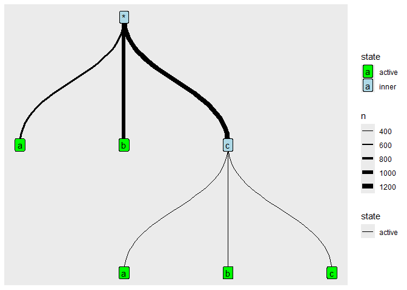

<!-- README.md is generated from README.Rmd. Please edit that file -->

# bacontrees

<!-- badges: start -->

[](https://github.com/Freguglia/bacontrees/actions/workflows/R-CMD-check.yaml)
[](https://app.codecov.io/gh/Freguglia/bacontrees)
<!-- badges: end -->

`bacontrees` is an R package for modelling discrete sequential data
using **Ba**yesian **Con**text **Trees** (BaCon Trees). Context trees,
also known as Variable Length Markov Chains (VLMCs), are parsimonious
Markov models where the order of dependence can vary with the observed
past. `bacontrees` provides:

- A **frequentist** method: `fit_vlmc()` estimates the context tree via
  the context algorithm with likelihood-ratio pruning.
- A **Bayesian** method: `metropolis_vlmc()` (and the `baConTree` class)
  runs a Metropolis-Hastings MCMC sampler to obtain a full posterior
  distribution over context trees.
- Simulation utilities (`rvlmc()`) and construction helpers
  (`treeFromContexts()`).
- R6 classes (`ContextTree`, `baConTree`) that expose the full tree
  structure for building custom algorithms.

## Installation

You can install the development version of bacontrees from
[GitHub](https://github.com/Freguglia/bacontrees) with:

``` r
# install.packages("pak")
pak::pak("Freguglia/bacontrees")
```

Or with **devtools**:

``` r
# install.packages("devtools")
devtools::install_github("Freguglia/bacontrees")
```

## Background

A **Variable Length Markov Chain** (VLMC) is a Markov model where the
relevant past (the *context*) that determines the next symbol’s
distribution has a variable length. Further pasts are only distinguished
when the data supports it, making VLMCs much more parsimonious than
fixed-order Markov chains.

The set of contexts forms a complete subtree of the full (maximal)
suffix tree over the alphabet. `bacontrees` represents this subtree
explicitly as a `ContextTree` object, whose *active* leaf nodes are
exactly the contexts of the fitted model.

## Usage

### Included data

The package ships with two example datasets — `abc_vec` (a single
sequence of length 1000) and `abc_list` (a list of three sequences of
length 1000 each) — generated from a three-symbol VLMC with alphabet
`{a, b, c}`.

``` r
library(bacontrees)
data(abc_list)
head(abc_list[[1]], 20)
#>  [1] "a" "c" "a" "c" "a" "c" "c" "b" "c" "b" "a" "c" "c" "b" "c" "b" "c" "b" "b"
#> [20] "c"
```

### Simulating sequences from a VLMC

Use `rvlmc()` to generate synthetic sequences given a context list and
the corresponding transition probability vectors.

``` r
alphabet      <- c("a", "b", "c")
context_list  <- c("*.a", "*.b", "*.c.a", "*.c.b", "*.c.c")
context_probs <- list(
  c(0.10, 0.20, 0.70),  # after 'a'
  c(0.33, 0.33, 0.34),  # after 'b'
  c(0.20, 0.10, 0.70),  # after 'ac'
  c(0.01, 0.98, 0.01),  # after 'bc'
  c(0.40, 0.40, 0.20)   # after 'cc'
)

set.seed(42)
seq1 <- rvlmc(1000, alphabet, context_list, context_probs)
head(seq1, 20)
#>  [1] "a" "a" "a" "a" "c" "c" "b" "a" "b" "a" "a" "c" "c" "a" "c" "c" "b" "c" "b"
#> [20] "b"
```

### Building a context tree manually

`treeFromContexts()` creates a `ContextTree` whose active nodes exactly
match a supplied set of contexts.

``` r
ct <- treeFromContexts(c("*.a", "*.b", "*.c.a", "*.c.b", "*.c.c"))
ct$getActiveNodes()
#> [1] "*.c.b" "*.c.c" "*.a"   "*.b"   "*.c.a"
```

You can also create a `ContextTree` directly and manipulate it:

``` r
tree <- ContextTree$new(abc_list, maximalDepth = 3)
tree$activateMaximal()   # start from the deepest level
tree$getActiveNodes()
#>  [1] "*.a.b.c" "*.b.c.a" "*.a.a.a" "*.b.c.b" "*.a.a.b" "*.b.c.c" "*.a.a.c"
#>  [8] "*.b.b.a" "*.b.b.b" "*.b.b.c" "*.c.c.a" "*.b.a.a" "*.c.c.b" "*.b.a.b"
#> [15] "*.c.b.a" "*.c.c.c" "*.b.a.c" "*.c.b.b" "*.c.b.c" "*.c.a.a" "*.c.a.b"
#> [22] "*.c.a.c" "*.a.c.a" "*.a.c.b" "*.a.b.a" "*.a.c.c" "*.a.b.b"
```

### Frequentist fitting — `fit_vlmc()`

`fit_vlmc()` implements the classical context algorithm: build a maximal
tree, then prune nodes whose likelihood-ratio test statistic falls below
`cutoff`.

``` r
fit <- fit_vlmc(abc_list, cutoff = 20, max_length = 4)
fit$getActiveNodes()
#> [1] "*.a"   "*.b"   "*.c.a" "*.c.b" "*.c.c"
```

### Visualising a context tree

`ContextTree` (and `baConTree`) objects have an S3 `plot()` method that
uses **ggraph** internally and can be customised like any ggplot2
object.

``` r
plot(fit)
```



### Bayesian inference — `metropolis_vlmc()`

`metropolis_vlmc()` runs a Metropolis-Hastings MCMC sampler and returns
the posterior distribution over context trees, summarised as a data
frame ordered by posterior probability.

``` r
library(progressr)

with_progress({
  result <- metropolis_vlmc(
    abc_list,
    n_steps       = 2000,
    max_depth     = 3,
    alpha         = 0.01,
    context_weights = function(node) -node$getDepth() / 3,
    burnin        = 200
  )
})

print(result)
#> Tree with highest posterior probability ( 1 ):
#> { *.a, *.c.a, *.b, *.c.b, *.c.c }
#> # A tibble: 1 × 4
#>   tree_contexts                prob     n tree_code 
#>   <chr>                       <dbl> <int> <chr>     
#> 1 {*.a,*.c.a,*.b,*.c.b,*.c.c}     1  1800 AAAAADNAAA
```

The returned object contains:

| Field        | Description                                                 |
|--------------|-------------------------------------------------------------|
| `$df`        | Data frame of context sets ranked by posterior probability  |
| `$codes`     | Named list mapping tree codes to their context vectors      |
| `$chain`     | Full MCMC chain of tree codes (for convergence diagnostics) |
| `$baConTree` | The `baConTree` object used internally                      |

### Fine-grained Bayesian control — `baConTree`

For more control, use the `baConTree` R6 class directly.

``` r
bt <- baConTree$new(abc_list, maximalDepth = 3, alpha = 0.01,
                    priorWeights = function(node) -node$getDepth() / 3)

with_progress(bt$runMetropolisHastings(2000))

chain <- bt$getChain()
head(chain)
#>   t       tree
#> 1 0 AAAAAAAAAB
#> 2 1 AAAAACKAAA
#> 3 2 AAAAADNAAA
#> 4 3 AAAAADNAAA
#> 5 4 AAAAADNAAA
#> 6 5 AAAAADNAAA
```

## Class reference

### `ContextTree`

The core data structure. Manages the maximal suffix tree, tracks which
nodes are *active* (the current context set), and handles data
attachment.

| Method | Description |
|----|----|
| `$new(dataset, maximalDepth, active, alphabet)` | Construct a context tree |
| `$getActiveNodes()` | Return paths of active (leaf) nodes |
| `$getLeaves()` | Return paths of maximal-tree leaves |
| `$getInnerNodes()` | Return inner nodes of the active tree |
| `$activateRoot()` | Set active tree to root-only |
| `$activateMaximal()` | Set active tree to all maximal leaves |
| `$activateByCode(code)` | Restore a previously stored tree code |
| `$growActive(path)` | Grow the active tree at a given node |
| `$pruneActive(path)` | Prune the active tree at a given node |
| `$setData(dataset)` | Attach sequence data and compute counts |
| `$getDataset()` | Retrieve attached `Sequence` object |
| `$getAlphabet()` | Retrieve the `Alphabet` object |
| `$activeTreeCode()` | Compact binary encoding of the active tree |
| `$igraph()` | Convert to an `igraph` object |
| `plot(ct)` | Plot with **ggraph** |

### `baConTree`

Extends `ContextTree` with Bayesian machinery.

| Method | Description |
|----|----|
| `$new(data, maximalDepth, alpha, priorWeights, active)` | Construct a Bayesian context tree |
| `$runMetropolisHastings(steps)` | Run the MCMC sampler |
| `$getChain()` | Retrieve the sampled chain as a data frame |
